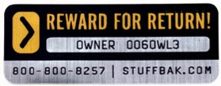
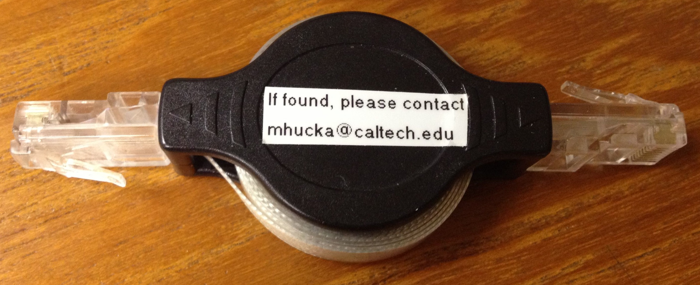

<figure class="float-right width-25">
  
</figure>

For a number of years, a company called [StuffBak](http://www.stuffbak.com) has been making a system available for helping lost items get returned back to their owners.  The scheme involves a sticker that has a unique identification number together with the StuffBak phone number and web address on it, plus an online registration system. You get a sticker, you register it with StuffBak, you stick it on an item, and if the item is ever lost and someone finds it, hopefully the finder will contact StuffBak, who in turn will contact you. You can offer a reward for the return of the item. It's a great idea, and apparently it does work.

Here I want to describe a simpler do-it-yourself alternative that has already worked for me once, and I think stands as much or more chance of getting expensive stuff back to you. I use a label maker (one of the many [Brother label makers](http://www.brother-usa.com/Ptouch/For_Home/#.UsILx6Ub22k)) to print small plastic-covered labels that say the following: *"If found, please contact mhucka@caltech.edu"*. I put this on the back of my iPhone, my cell phone, the bottom of my laptop, power adapters, laptop video cable adapters, airline power adapter, laser pointer, USB dongles, etc. – anything that's big enough to put a label on. 

<figure class="float-right width-50">
  
</figure>

The nice thing about modern label makers is that they can print in various font sizes, so you can make very small labels, medium ones, and really big ones. You can also get different label colors: black letters on white background, black letters on transparent background, white letters on black background, and so on. This lets you tailor the label to the particular device and make the label more attractive and discreet. The plastic-coated labels are waterproof too.

I don't want to engrave most devices because they get replaced after a couple of years, at which time I probably want to sell them or give them to someone. A permanent engraving reduces the value of the device to the next person. Redistributing and reselling devices is an important part of managing your gadget world :-). Plus, if I change email addresses, I can simply replace the labels, which is much easier than dealing with engravings.

Yes, the labels are not permanent. My reasoning is that if someone is the type of person who *would* return something they found, then they'll do it, and you just need to give them a way to contact you. Email is better than a phone number, IMHO. On the other hand, if the finder is the kind of person who *won't* return something, then nothing you do will make them return it – StuffBak label or no label. Even engravings can be rubbed off, or the affected panel replaced, etc.

And finally – OK, this is probably just wishful thinking on my part – I like to think that something so naively trusting as a simple label and a straightforward request to be contacted conveys a kind of implicit trust in the stranger who finds the item. Maybe it will encourage the finder to do a good deed.

It has already helped a video adapter dongle find its way back to me after a workshop, so I know it *can* work.
