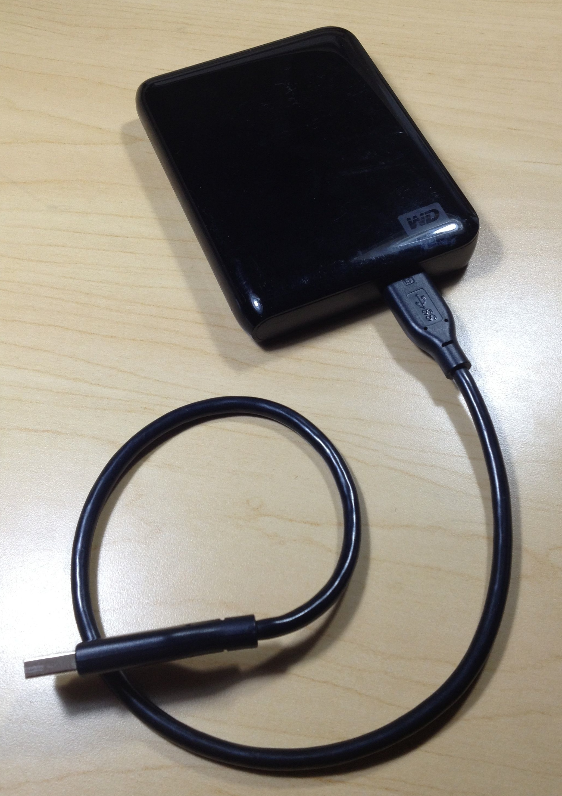

Most of us working in the computational science and information technology areas use our laptops as our primary computers.  They're absolutely essential to our work (and even our non-work lives), and any problems can completely disrupt our productivity.  This is why it's a constant surprise to me to discover how many computational scientists do not seem to have a regular, high-frequency, computer backup solution in place.

I learned the hard way that even a relatively new laptop's disk can fail unexpectedly.  In 2008, the disk on my then-only 7 months old laptop failed with a *hardware* failure.  One minute I'm working right along, the next minute the disk is unreadable.  My backups at the time were 12 days old.  Why were my backups so old?  Because I got lax in doing them.  I thought, "This is too new – it's not in danger of failing so soon.  I'll set up a better backup scheme next week."  That was a disruptive and expensive lesson.  I ended up using a disk recovery service that charged $1500 and took over two weeks to recover the contents of the disk.  (Apparently what they do is disassemble the disk drive in a clean room, take the platters off and put them in another drive casing, and somehow manage to make things work enough to be able to read data off.)

That experience led to the three-tiered approach I use today.  It is as automated as I could make it, because anything that requires manual intervention is in danger of being neglected eventually.  (And odds are, the time you neglect it is exactly when you need it the most.)  Here follows an explanation of my approach and some suggestions.

Automated, hourly, incremental backups 
----------------------------------------------------

Hourly backups are important for at least two reasons: (1) to avoid disruption of your work if a sudden hardware failure or other problem arises, and (2) so that if you delete a file accidentally, you can recover a relatively recent version of it.  *Incremental* backups are important because you want a system that backs up only the changes to your files, not entire files; this saves disk space and time.

Since I use Mac OS X, I use [Time Machine](http://en.wikipedia.org/wiki/Time_Machine_(OS_X)) to perform incremental hourly backups.  It is truly one of the best features of Mac OS X; a set-up-and-forget incremental backups system that doesn't even require you to worry about stopping the backup process before unmounting your disks – you can unmount them and take your laptop at a moment's notice, and the next time you plug your disk(s) back in, Time Machine will restart and continue its work.   Time Machine is built into Mac OS X, but there are other similar solutions for other operating systems.

An important consideration to making this practical is to have a sufficiently fast interface on the backup disk drive.  I find that a disk connected over USB 2.0 is not fast enough, even if the disk itself is fast.  When you try to back up a disk with 300 GB or more, the step of comparing your disk to the backups to identify the changes can take *hours* over a USB 2.0 interface.  A FireWire 800 interface has become the minimum necessary in my case; USB 3.0 is even better.

Because I work from home much of the time, as well as work from two offices, I put backup disks in all locations.  Time Machine lets you configure multiple disks and will use whichever one is available automatically.

By the way, if you're a programmer, you may think that keeping your files in git or Mercurial or a similar repository is enough.  I would argue no, for two reasons.  First, do you put *everything* in your version control system?  Everything including your mail files, the configuration and preferences files for various programs you use, etc.?  I would wager that the answer is no.  Second, do you check in all the changes every hour?  Again, I bet the answer is no.

Automated, daily, *bootable* mirror on external disk
------------------------------------------------------------------

Having backups is good, but what will you do if the main disk in your computer fails and you cannot boot?  "Drive to the computer store" may not be an option if you are traveling, but even if it is, recovering or reinstalling a disk from backups is a time-consuming affair.  A better and simpler solution is to have a disk you can boot from and that contains a recent copy of your entire disk. That way, you can not only become operational again almost immediately; the recovery from hourly backups will go much faster. 

<figure class="float-right width-33">
  
</figure>

To implement this, I use a small portable disk and a cloning utility ([Carbon Copy Cloner](http://www.bombich.com)) that is set to mirror the contents of my laptop drive to the external disk on a nightly basis.  When at home, I leave this disk plugged into my laptop; when traveling, I make sure to plug it in when in my hotel room in the evening.  If a catastrophe happens and my laptop's drive fails, I can plug in the external mirror and boot from it, and have a system that is no more than 24 hours of out date.  

If you have the option to use an external disk that can potentially be swapped for your computer's internal drive, then that's the best solution.  Then, if your internal drive fails, you can pull the mirror disk out of its enclosure and put it inside your laptop.  Voilà, you have a working computer again.  However, not all modern laptop drives are removable (oh, hi, MacBook Air!), so this is not always possible.  The crucial thing in any case is to make sure the external mirror disk is *something you can boot from*.

Of course, nightly backup operations will not run if your computer is turned off.  I always leave my laptop running at night (whether at home or traveling) so that the disk mirroring and off-site backups (below) are performed.

Note that the bootable mirror accomplishes a different goal than hourly backups: the Time Machine backups are not bootable, and unless you carry your Time Machine backups disk with you wherever you go, you may not be able to access your backups anyway.  If you're traveling, the only hourly periodic backups you are likely to have are network-based (see the next item), and you may not be able to access them if you can't boot your computer.

Automated, daily, off-site, *networked* backups
-------------------------------------------------------------

All of the above are still not enough.  It is crucial to have one more backup scheme in place: *off-site*, networked backups.  If your portable mirror disk fails while you're traveling, you don’t *all* backups to stop being performed as a result; if your laptop and your luggage are stolen while you're traveling, you want access to your files; if your house or place of work is robbed or experiences a fire, you want a copy of your entire disk that is not co-located with your backup disk, your mirror disk and your laptop.

To implement this, I personally use [CrashPlan](http://www.code42.com/crashplan/), an excellent service that has really solved over-the-net, cross-platform backups for me.  Previously, I developed a home-grown solution using rsync, but CrashPlan is even better and simpler.  CrashPlan offers free plans as well as paid plans; you can use the free plan with a backup server of your own and achieve nightly remote backups from wherever you are.  I set up a server in my office that acts as a group CrashPlan server for myself and my team.  I have it set to back up every 24 hours, and since it works over the net, it works from wherever I am, whether at home or at work or traveling. 

Once again, to make this work, I leave my computer running overnight and connected to a network, both at home and in hotel rooms while traveling.

A lot of people use an alternative scheme, such as putting their most important files in [Dropbox](http://dropbox.com).  In fact, I tried this for a time, too – it seemed like a great idea to put my working set of files (notes, software projects, etc.) in a Dropbox folder, so that I can access them from any computer or device.  But I soon stopped.  The approach has drawbacks.  One is that, since you typically don't put your *entire* computer's disk drive in Dropbox, you are at risk of losing something that you did not think to put in Dropbox.  Another drawback is the performance impact of putting high turnover files in Dropbox: every time you touch a file, Dropbox immediately begins to synchronize that file, which uses CPU, disk I/O and network I/O.  I only had to compile a large program once to realize the impact is just too much for me.

Dropbox does have the advantage that it records changes almost immediately, so your network copy will be, on average, more recent than a copy made using a periodic backup scheme.  This is a tradeoff of computer performance versus backup recency.  I chose performance over backup recency because I have the other backup mechanisms in place, but the choice may be different for other people or other uses.  (It’s worth noting, however, that if you use the paid version of CrashPlan, you can adjust the backup frequency down to once every 15 minutes if you wish.)
