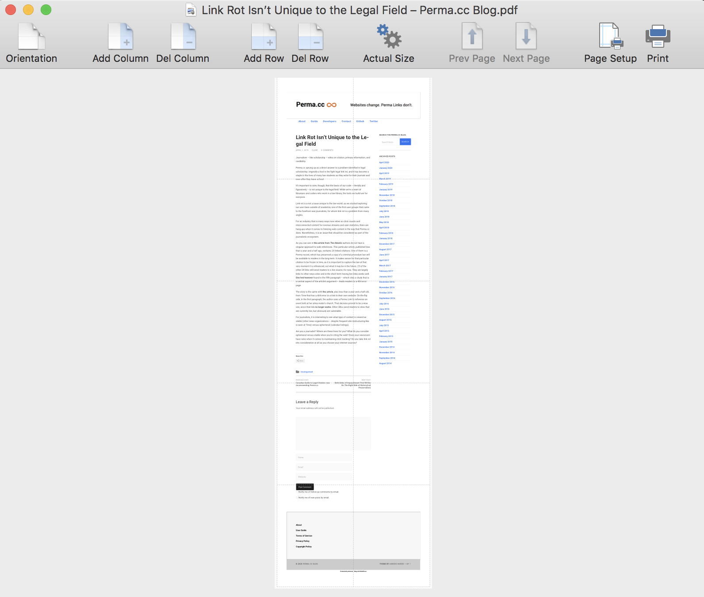
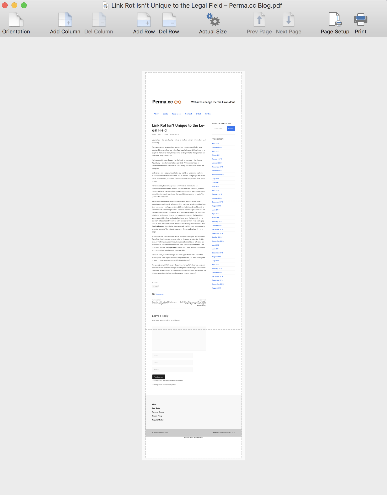
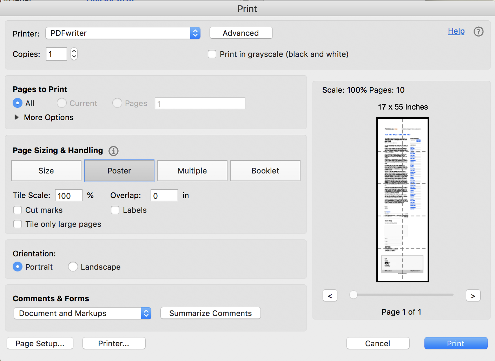

I like to save web pages as single-page PDF files.  The result provides a snapshot of a page exactly as it appears when I see it in my browser, but without the page-breaks that come from using a typical print-to-PDF approach.  I personally find PDFs to be more convenient than something like [WARC](https://en.wikipedia.org/wiki/Web_ARChive) when it comes to storing in [DEVONthink](https://www.devontechnologies.com/apps/devonthink) or [Zotero](https://www.zotero.org), as well as for purposes of annotation, search, and general file management.

Viewing long PDFs is no problem on electronic devices such as computers and tablet, but every once in a while, I want to print a page to physical paper, or more rarely, convert the original unpaginated single-page PDF to a paginated PDF file, so that it can be included in another document.  This leads to a problem because there is no facility in the default system on macOS to tile a printout across multiple pages (also known as "posterizing" and "tile cropping").

After searching and experimenting with multiple approaches, I have found two that work.

## Mindcad Tiler

[Mindcad Tiler](http://mindcad.com/tiler.html) is a low-cost ($5 at the time of this writing) commercial application available through the Apple App Store.  It does one thing: tile files for printing.  Here is how I use it to print a long single-page PDF file.  

1. Start Mindcad Tiler and open the PDf file.  
2. Click on Page Setup and select the destination printer.
3. Click on the "Actual size" button in the toolbar. This will rescale the preview and show you outlines of print pages.  (Those are the thin gray grid lines in the screenshot below.) <figure></figure>
4. Use the **Del Column** button in the toolbar to get it to use only one physical page horizontally.  It will span multiple pages but only in the vertical direction (in this example, 3 pages): <figure></figure>
5. If necessary, use the **Del Row** button to get rid of blank pages at the beginning and the end.  (Whether you need to do this depends on the particular file you're working with and how it happens to tile.)

Now you can print to paper, or (since Tiler uses the macOS print dialog) save the result to another (this time, paginated) PDF file in [the normal way](https://support.apple.com/guide/mac-help/save-a-document-as-a-pdf-on-mac-mchlp1531/mac).

## Acrobat Reader DC (free)

The free version of Acrobat Reader can also do posterizing or tile cropping.  To use it to do that, from the print dialog, first select "Poster":

<figure></figure>

Next, you have to manually play with the "Tile Scale" value until you get a single vertical column of pages.  I usually start with the value "50%" and then adjust it depending on what happens with the particular file I'm working with.

Now, the tricky thing with Acrobat is how to print to another PDF if you want to save the result as a paginated PDF file.  Adobe frustratingly disables the normal system print dialog (at least on macOS), and it doesn't provide a save-to-PDF function itself.  So, what do you do?

The easiest solution I have found is to install [PDFwriter](https://pdfwriterformac.sourceforge.io/) (note: _not_ the commercial Windows application of the same name).  It's a free, open-source application that acts as a print destination in the macOS print dialog.  Once installed, you can print to it from Acrobat, and PDFwriter will save the output as a PDF file in its default output location (which is configurable from within PDFwriter itself).

## Other options

There exist some other options for tiling PDF files across multiple pages.  Here are some that I've seen mentioned repeatedly in discussions, but I have not tried them myself:

* [pdfposter](https://gitlab.com/pdftools/pdfposter)
* [pdftilecut](https://github.com/oxplot/pdftilecut)
* [ImageMagick](http://www.imagemagick.org/Usage/crop/#crop_tile) has a crop tiling capability

