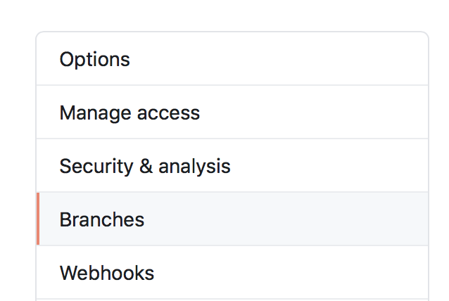
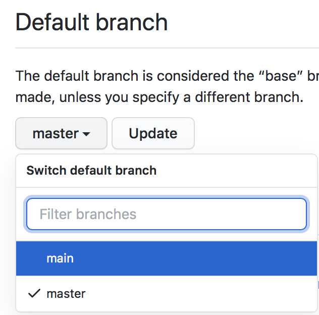

The Caltech Library software development group is in the process of updating as many of our git repositories as possible in order stop using the name `master` for the primary branch.  We settled on the name `main` as the replacement. It is not yet clear every one of our GitHub repositories can be so changed, but many can. Having decide to do it, the next natural question is, how does one make the change?

After Googling for solutions, many of which go to old Stack Overflow questions with many varied answers, and reading them, and trying to understand them (made difficult by the [UX horror that is git](https://news.ycombinator.com/item?id=12622414)), I settled on the following procedure.  It's based in large part on [a GitHub gist](https://gist.github.com/ccopsey/9866a0bcb0b39ade04fe#gistcomment-3350164) written by GitHub user _Comevius_:

1. Change the name of the branch in your local git repository:
    ```language-bash
    git branch -m master main
    ```
2. Push the new branch to the origin (presumed here to be on GitHub) and simultaneously set your local copy to track `origin/main` instead of `origin/master` with the following one-line command:
    ```language-bash
    git push -u origin main
    ```
3. Go to your repo on GitHub, click on the _Settings_ tab across the top, then click on _Branches_ in the left-hand list of items:  
    <figure></figure>
4. In the _Branches_ panel, change the default branch to be `main` and click the _Update_ button:  
    <figure></figure>
5. Now go back to your local repository copy, and type one final command to delete `origin/master`:
    ```language-bash
    git push origin :master
    ```
